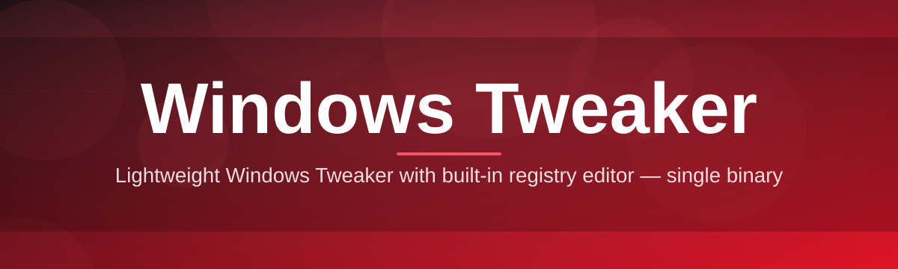

# win-tweak-optimizer 🚀🪟

  

*A calmer, faster, more honest Windows — dialed in with one tool instead of forty forum posts.*

| Requirement | Minimum |
|---|---|
| OS | Windows 10 (21H2+) or Windows 11 |
| Architecture | 64-bit (x64 / ARM64) |
| Disk space | ~120 MB |
| Admin rights | Recommended for full tweak access |
| Dependencies | None — fully standalone |

  

---

## 🧭 Overview

**win-tweak-optimizer** is a Windows tweaking and optimization utility built for people who are tired of tuning their PC by copy-pasting registry snippets from random forum threads. It's a single, self-contained toolkit that gathers the most impactful — and most misunderstood — Windows performance settings into one clean interface, so you can see exactly what a tweak does before you commit to it.

The Windows tweaker space has always had a trust problem: half the tools out there ask you to run mystery scripts, and the other half bury real settings under paywalls and clutter. This project exists as a counterpoint — transparent, readable, and reversible. Every optimization is documented, every change is snapshotted, and nothing runs silently in the background. Whether you're squeezing extra frames out of an aging laptop, de-bloating a fresh Windows 11 install, or just curious what your startup sequence is actually doing to your boot time, this tool is built to answer that plainly.

It's aimed at three kinds of people: gamers chasing lower input latency and higher consistent framerates, everyday users who want a system that feels new again without reinstalling Windows, and power users/sysadmins who want a repeatable, auditable way to apply the same baseline tweaks across multiple machines. You don't need to know what a registry hive is to use it — but if you do, you'll appreciate that we never hide the details from you.

---

## ⚡ How It Works

Instead of dumping a wall of checkboxes on you, win-tweak-optimizer walks you through a flow — and the very first step is the part people love most.

1. **Instant System Snapshot (the wow factor)** — the moment you open the app, it scans your CPU, GPU, RAM, storage type, startup load, and background services, then builds a personalized *before* profile in seconds. No manual digging through Task Manager tabs — you get a full picture of where your Windows install is losing time and responsiveness, visualized in one screen.

2. **Guided Recommendation Pass** — based on that snapshot, the optimizer highlights the tweaks most likely to matter for *your* specific hardware and use case (gaming rig vs. thin-and-light laptop vs. office workstation get very different suggestions).

3. **One-Click Apply, Fully Reversible** — every tweak is bundled with an automatic restore point, so applying a batch of changes is a single click, and undoing it is just as fast.

4. **Live Verification** — after applying, the tool re-measures the same metrics from step 1 so you can see the actual delta, not just take our word for it.

5. **Ongoing Health Checks** — win-tweak-optimizer can re-scan periodically to flag configuration drift (a Windows Update quietly re-enabling telemetry, a driver reinstalling a startup task, etc.).

> [!NOTE]
> The initial scan is read-only. Nothing on your system changes until you explicitly click Apply on a specific tweak or profile.

---

## 🎯 What It Actually Tweaks

- **Startup & Background Load Control** — see every program and service fighting for CPU/disk time at boot, and disable the ones that aren't earning their place.

- **Gaming Latency Profile** — a bundled preset that adjusts power plan, GPU scheduling, and input-related settings specifically for lower and more consistent frame times.

- **Privacy & Telemetry Dial** — granular control over Windows diagnostic data, ad ID, activity history, and background data collection, explained in plain English rather than policy jargon.

- **Visual Effects Rebalancer** — trims animation and transparency overhead on lower-end hardware while keeping the UI usable, or leaves it untouched on high-end rigs where it barely matters.

- **Storage & Update Housekeeping** — surfaces temp files, delivery-optimization cache, and old update leftovers that quietly eat into your free space.

- **Network Stack Tuning** — adjusts throughput-related settings (DNS behavior, Nagle-related options, throttling indexes) for lower latency without breaking stability.

- **Context Menu & Explorer Cleanup** — strips years of accumulated shell extension clutter that slows down right-click menus.

- **Snapshot & Rollback System** — every applied profile creates a restore point automatically, so experimenting never feels risky.

> [!TIP]
> Not sure where to start? Run the **Balanced** preset first — it applies the highest-confidence, lowest-risk tweaks and is a great baseline before you go hunting for more aggressive gaming or privacy profiles.

---

## 🧗 Getting Started

Getting up and running takes about two minutes, start to finish:

1. **Visit the landing page** using the download button above (or below) — that's the only official source for this tool.

2. **Download the installer/executable** for your Windows version.

3. **Run it** — Windows may show a SmartScreen prompt for new or lesser-known applications; click "More info" → "Run anyway" if you trust the source.

4. **Let the initial scan finish**, review the recommendations, and apply whichever profile matches what you're optimizing for (gaming, battery life, privacy, or general snappiness).

> [!IMPORTANT]
> Running as Administrator unlocks the full tweak set. Without elevated permissions, several deeper system-level optimizations will be grayed out — the app will tell you exactly which ones.

---

## 🖥️ System Requirements

| Component | Requirement |
|---|---|
| Operating System | Windows 10 (21H2 or later) / Windows 11 |
| CPU | Any x64 or ARM64 processor from the last decade |
| RAM | 2 GB minimum, 4 GB+ recommended |
| Disk | ~120 MB free space |
| Internet | Only needed for the initial download |
| Runtime dependencies | **None** — fully standalone, no separate frameworks to install |

  

---

## 🧩 How It's Built (Architecture Notes)

Click to expand a peek under the hood

- **Detection layer** reads hardware and OS state through native Windows APIs — no third-party telemetry SDKs involved.

- **Tweak engine** stores every optimization as a discrete, named unit with an explicit "apply" and "revert" action — nothing is a one-way door.

- **Profile layer** groups tweak units into presets (Gaming, Battery Saver, Privacy-First, Balanced) that you can also mix and remix manually.

- **